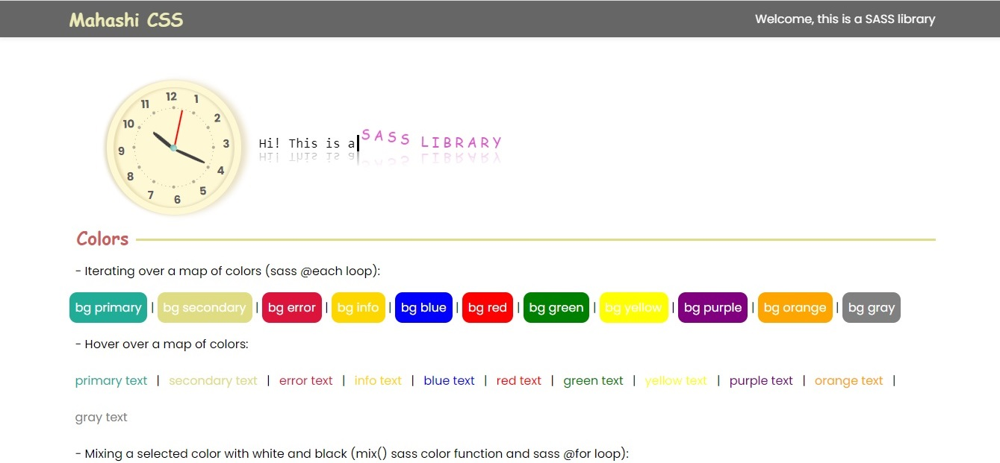
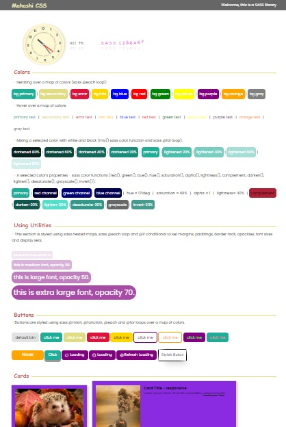

# My-SASS-Library

#### By _**Mahashi-github**_

#### This is a SASS application. This is partially related to Net Ninja's SASS tutorial.

## Technologies Used
* _HTML_
* _CSS_
* _SASS_
* _Node.js_
* _Gulp(task runner)_
* _Gulp-sass_
* _Gulp-purgecss_

## Setup
To run this project, install it locally using npm:

```
$ npm install
$ gulp
```
## Screenshot of the Application
<p>
  
  
</p>